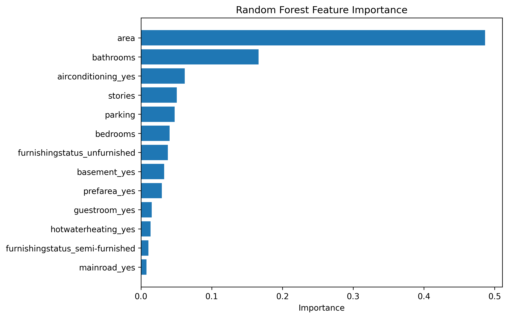
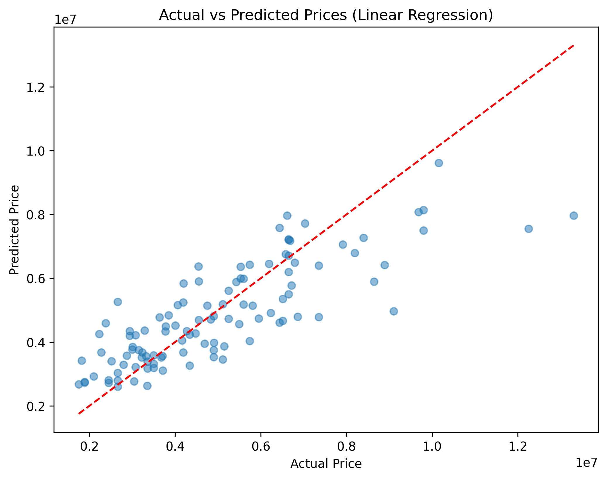

# House Price Prediction using Machine Learning

## Project Overview
This project predicts house prices using machine learning techniques. The dataset contains information such as area, bedrooms, bathrooms, parking spaces, furnishing status, and other property features.

## Dataset
- 545 records
- 13 features
- No missing values
- No duplicate records

## Technologies Used
- Python
- Pandas
- NumPy
- Matplotlib
- Seaborn
- Scikit-Learn

## Data Preprocessing
- Checked for missing values
- Checked for duplicates
- One-Hot Encoding for categorical features

## Feature Importance

## Actual vs Predicted Prices

## Models Used
### Linear Regression
- MAE: 970,043
- RMSE: 1,324,507
- R² Score: 0.653

### Random Forest Regressor
- MAE: 1,021,546
- RMSE: 1,400,566
- R² Score: 0.612

## Visualizations
- Price Distribution Histogram
- Correlation Heatmap
- Feature Importance Plot
- Actual vs Predicted Prices

## Key Findings
- House area is the most influential feature.
- Linear Regression outperformed Random Forest.
- Property size and amenities strongly affect price.

## Future Improvements
- Add location-related features.
- Try XGBoost and Gradient Boosting.
- Perform hyperparameter tuning.
